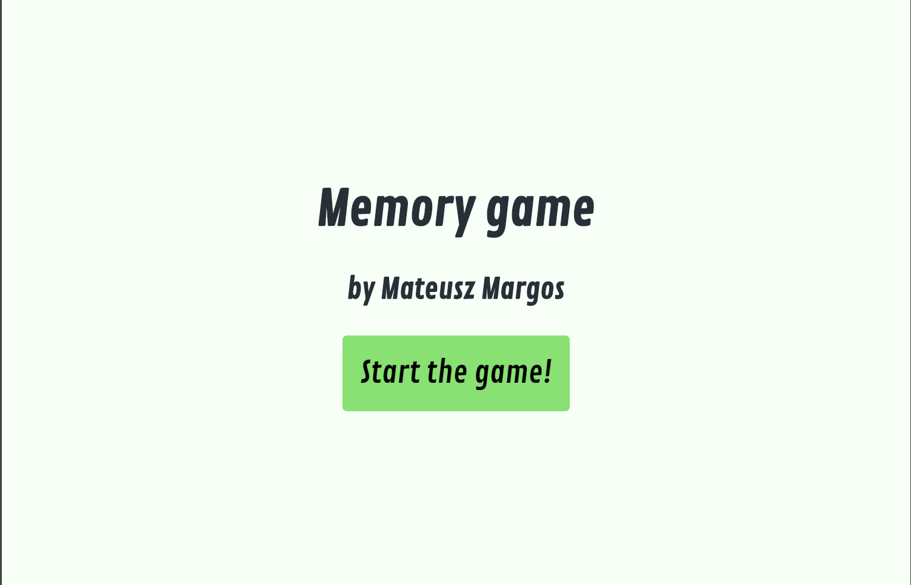
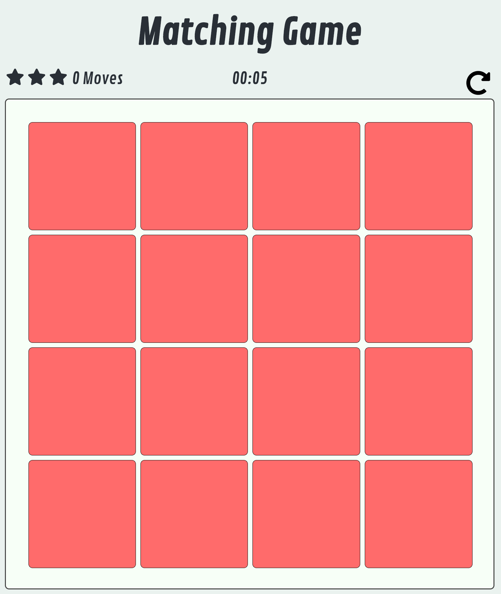
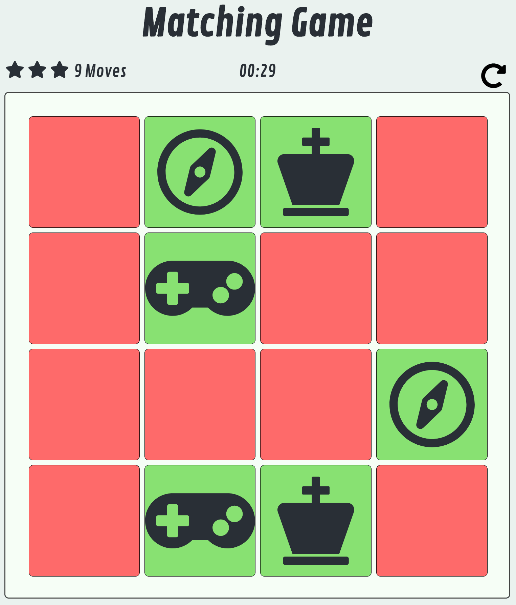
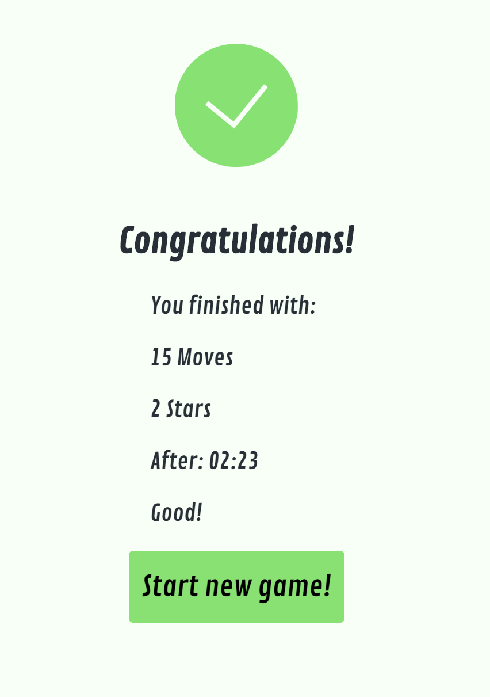

# Project Memory Game

Memory game project for Udacity Google Nanodegree Scholarship.

Author: Mateusz Margos

## How to play

Simply press "Start the game!" button on the start screen.\
You have to find all card pairs by clicking and comparing cards on the board.\
After finding all pairs end screen will appear with game stats.\
You can play again by clicking on "Start new game!" button.\
During game, above the game board, you can find statistics realted to the current game.\
From the left:
- Stars rating - performance rating of the current game - max 14 moves for 3 stars, 19 moves for 2 stars, 24 moves for 1 star.
- Moves count - number of times player compared cards pair
- Timer
- Restart button - player can restart the board and statistics at any time during the game

## Technologies used

HTML 5 for game core structure\
CSS 3 for styling\
ES6 for game logic\
jQuery 3.3.1 for operating on DOM elements\
FontAwesome 5.0.8 for all the icons in the game

## Screenshots

Start screen:

Game just after start:

Gameplay:

End screen:

### Contributing
Not applicable.